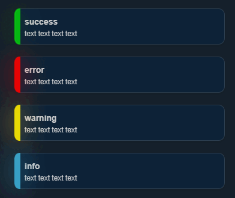

# notifly 
<div align="center">

</div>
## Usage

```javascript
notify({
    type: "warning", //alert | success | error | warning | info
    title: "Alert",
    message: "jQuery Notify.js Demo. Super simple Notify plugin.",
    position: {
        x: "right", //right | left | center
        y: "top" //top | bottom | center
    },
    icon: '', //<i>
    size: "normal", //normal | full | small
    overlay: false, //true | false
    closeBtn: true, //true | false
    overflowHide: false, //true | false
    spacing: 20, //number px
    theme: "dark-theme", //default | dark-theme
    autoHide: false, //true | false
    delay: 2500, //number ms
    onShow: null, //function
    onClick: null, //function
    onHide: null, //function
    template: '<div class="notify"><div class="notify-text"></div></div>'
});
```
```javascript
        notif = (type, title, message, icon, autoHide) => {
            notify({
                type: type, //alert | success | error | warning | info
                title: title,
                message: message,
                position: {
                    x: "right", //right | left | center
                    y: "bottom" //top | bottom | center
                },
                icon: icon, //<i>
                size: "normal", //normal | full | small
                overlay: false, //true | false
                closeBtn: false, //true | false
                overflowHide: false, //true | false
                spacing: 20, //number px
                theme: "default-theme", //default | dark-theme
                autoHide: autoHide, //true | false
                delay: 2500, //number ms
                onShow: null, //function
                onClick: null, //function
                onHide: null, //function
            });
        }
        // self.notif("error", "Error", "Server liefert keine Session: " + response.errorMessage, false);
```    
